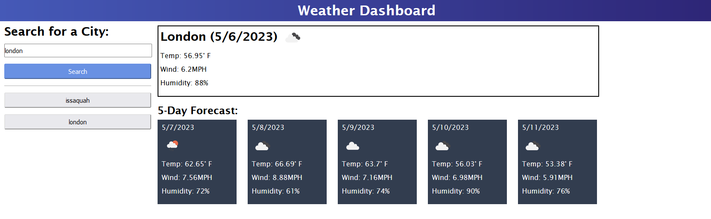

# Weather Chart Challenge 6

## Description

This is a website dedicated to using a weather API to find the current weather, temperature, humidity, and windspeed of various cities, as well as future weather up to 5 days in the future. It saves previous searches in an easy to access set of buttons.

## Installation

N/A

## Usage

All you have to do is search up a city by name and it will pull up the most relevant city option. If you would like to use a previous search, just click on one of the buttons below with the same name.

https://chickenchamp71.github.io/weather-chart-challenge-6/

## Credits

N/A

## License

See license in repo.
